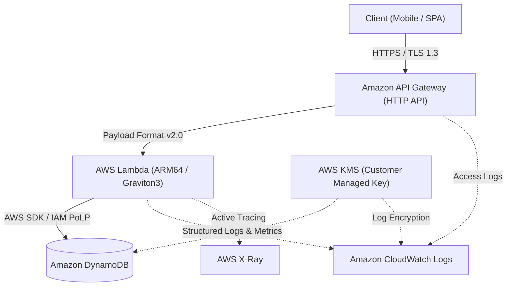

# Serverless DualForge IaC 🚀

低レイテンシ・高可用性・耐障害性を極限まで追求した、AWS完全サーバーレスRESTful API基盤です。
インフラストラクチャの宣言的信頼性と静的解析を司る **Terraform** と、型安全性・高速開発ループを牽引する **AWS CDK (TypeScript)** の「二刀流（Dual-Stack）」アプローチを採用しています。

---

## 🌟 アーキテクチャの特長

- **完全サーバーレス & イベント駆動**: Amazon API Gateway (HTTP API) + AWS Lambda (Graviton3 / ARM64) + Amazon DynamoDB (On-Demand)。
- **堅牢なセキュリティ基盤**: AWS KMS カスタマーマネージドキー (CMK) による保存データ暗号化、最小権限のIAMポリシー設計。
- **高耐障害性とリカバリ**: DynamoDB ポイントインタイムリカバリ (PITR) 有効化、マルチAZ自動冗長化。
- **オブザーバビリティ**: AWS X-Ray 分散トレーシング、CloudWatch Logs 構造化JSONログ出力。
- **二刀流 IaC アーキテクチャ**: ステートフル基盤からアプリ層まで、同一の堅牢な仕様を Terraform と CDK の双方で再現・検証可能。

---

## 📐 システム構成図



---

## 📁 ディレクトリ構造

```text
.
├── .github/                 # CI/CD パイプライン (GitHub Actions / tfsec / cdk-nag)
├── src/                     # Lambda 関数実装 (Node.js / Python)
│   └── handlers/
├── terraform/               # Terraform 実装資産 (v1.6+)
│   ├── environments/        # 環境別定義 (dev / prd)
│   ├── modules/             # 再利用可能コンポーネント (api, lambda, dynamodb)
│   ├── main.tf
│   └── versions.tf
├── cdk/                     # AWS CDK 実装資産 (v2 / TypeScript)
│   ├── bin/
│   ├── lib/
│   ├── cdk.json
│   └── package.json
└── README.md
```

---

## 🚀 展開手順 (Deployment Guide)

### 1. Terraform によるプロビジョニング

```bash
cd terraform/environments/dev
terraform init
terraform plan
terraform apply
```

### 2. AWS CDK によるプロビジョニング

```bash
cd cdk
npm ci
npx cdk diff
npx cdk deploy --all
```

---

## 🎭 キャスト（AIアプリ工場劇場）

- agent🔵 **Concept & Requirements**: 完全サーバーレス×二刀流IaCの要求定義とアーキテクチャ要件の策定
- agent🍇 **Infrastructure Architect**: Terraform & CDK のモジュール設計、セキュリティポリシーと暗号化標準の策定
- agent🍊 **Master Engineer**: 堅牢なIaCコードベース（Terraform/CDK）およびLambdaハンドラーの爆速実装
- agent🟢 **Quality Gatekeeper**: `tfsec`, `tflint`, `cdk-nag` を駆使した静的解析・セキュリティ監査と構成検証
- agent🟡 **Producer**: 本プロジェクト全体のプロデュース、リポジトリ統合およびドキュメントマネジメント
